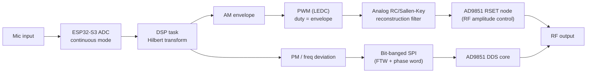
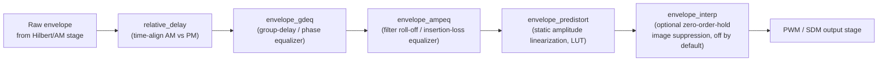

# Polar EER SSB Exciter (ESP32-S3 + AD9851)

An SSB/EER (Envelope Elimination and Restoration) signal generator built on an
ESP32-S3 driving an AD9851 DDS. A microphone signal is split in real time into
amplitude (AM) and phase/frequency (PM) components; PM is written straight
into the AD9851's frequency word, and AM is reconstructed as an analog control
voltage that modulates the DDS's RF output amplitude via its `RSET` current
reference.

## System overview

The AM path is a duty-cycle DAC: the LEDC peripheral's PWM output is low-pass
filtered into a slowly-varying DC-ish voltage that sets the AD9851's `RSET`
reference current, which the datasheet ties directly to full-scale RF output
current. The technique follows Analog Devices'
[AN-423, "Amplitude Modulation of the AD9850 Direct Digital Synthesizer"](https://www.analog.com/en/resources/app-notes/an-423.html)
(written for the AD9850, the AD9851's closely related sibling device, but the
same RSET current-control technique applies). AN-423 uses a MOSFET in place
of the fixed RSET resistor to allow the reference current — and therefore RF
output amplitude — to be voltage-modulated at rates well above 50 kHz.
Critically, AN-423's design sums the DDS's two complementary current outputs
(`IOUT`/`IOUTB`, which are 180° out of phase) through a broadband RF
transformer; without that bi-phase transformer, only one output is observed
and the resulting AM envelope comes out asymmetrical, whereas the
transformer-summed output is symmetrical — this is essential, not optional,
for a clean modulation envelope. An alternative AM path using
the ESP32-S3's built-in Sigma-Delta Modulator (`driver/sdm.h`) peripheral in
place of PWM has also been built and bench-compared (see
`group_delay_fit_notes.md`); PWM remains the default.

## Why AM/PM accuracy is hard

Splitting a signal into envelope and phase and later recombining it in the RF
domain only reproduces the original signal if both paths stay accurate *and
stay in step*. Three error sources dominate here:

- **Time synchronization** — the AM path (PWM → RC filter → RSET) and the PM
  path (direct SPI write) have different propagation delays through very
  different hardware. A time skew between them smears transitions and adds
  distortion that no amount of amplitude accuracy alone can fix.
- **Amplitude distortion** — the PWM/RC reconstruction chain is not perfectly
  linear (duty-cycle-to-voltage mapping, filter loading, RSET's own
  current-vs-voltage curve), so a raw envelope value doesn't produce a
  proportional RF amplitude without correction.
- **Phase / group delay** — the analog reconstruction filter's group delay is
  not flat with frequency, so different envelope frequency components arrive
  at the RSET node at slightly different times, distorting the envelope
  shape independently of any static amplitude error.

The firmware addresses each of these with a dedicated, independently
tunable correction stage:

- `relative_delay` — a (fractional-sample-capable) delay line that
  time-aligns the AM path against the PM path's own latency.
- `envelope_gdeq` — a group-delay equalizer compensating for the analog
  reconstruction filter's non-flat phase response.
- `envelope_ampeq` — an amplitude/insertion-loss shelf equalizer compensating
  for the same filter's high-frequency roll-off.
- `envelope_predistort` — a static, memoryless lookup-table correction for
  the AM path's duty-cycle-to-RF-amplitude nonlinearity.
- `envelope_interp` — optional envelope interpolation that updates the PWM
  duty register faster than the DSP's own sample rate, pushing the PWM
  zero-order-hold's spectral image further from the reconstruction filter's
  passband. Disabled by default (`ENVELOPE_INTERP_FACTOR=1`): it's a real,
  working technique, but running it costs processing time the ESP32-S3's
  thin per-tick CPU budget can't always spare, and in practice the
  amplitude-distortion (`envelope_predistort`) and group-delay
  (`envelope_gdeq`) corrections were found to matter more for real-hardware
  signal quality than interpolation did — so those two get priority for the
  available CPU budget, and interpolation is kept in the codebase for future
  tuning rather than enabled by default.

## Timing and performance

| Stage | Rate / period | Notes |
|---|---|---|
| ADC capture | 80 kHz continuous mode, 16-sample DMA frames | `ADC_CONT_SAMPLE_FREQ_HZ` / `ADC_CONT_FRAME_SAMPLES`; chosen so it divides evenly against both the DSP tick rate and the hardware timer resolution. |
| DSP tick / achieved Fs | 16 kHz (62.5 µs/sample) | `SAMPLE_RATE_HZ`; Hilbert transform uses a 65-tap FIR (`HILBERT_TAPS`). |
| PWM (AM) carrier | 64 kHz, 10-bit duty resolution | `RSET_MOD_LEDC_FREQ_HZ` / `RSET_MOD_LEDC_RES`, tuned to be an exact multiple of the DSP tick rate. |
| SDM (alternate AM path) | 1 MHz comparator rate, ±127 density clamp | `SDM_SAMPLE_RATE_HZ` / `SDM_DENSITY_CLAMP`; bench-compared against PWM, not the default. |
| PM / SPI write | Bit-banged, ~25–33 µs per frequency update | Hardware SPI was tried first but measured ~50 µs/write from driver call overhead alone; a direct bit-banged GPIO implementation removed that overhead. |

Frequency-deviation clamp (`MAX_FREQ_DEV_HZ`) is currently set to 20000.0f in
`config.h` — this was widened from an original 2800 Hz during diagnostic
testing and, per that define's own comments, has not yet been re-optimized to
a final tuned value; it is a "known good enough, not yet re-derived" setting,
noted here rather than glossed over.

### ESP32-S3 limitations encountered

Real-hardware development surfaced several platform-specific constraints
worth knowing before extending this project:

- Running the DSP task and other work on the same core as `loop()`/Serial
  starves normal Arduino-side servicing entirely; the DSP task is pinned to
  its own core.
- Any Core-1 activity that touches flash or shared buses (notably I2C
  transactions, e.g. from an auxiliary DAC task) can produce cache-line
  stalls that disrupt Core-0's real-time DSP timing — a class of bug this
  project has hit more than once, most recently a background I2C task
  accidentally left enabled introducing exactly this noise.
- CPU headroom at 16 kHz is thin (tens of microseconds of margin per tick);
  an unexplained ~32 µs cache/scheduling stall shows up even in fully
  IRAM-resident code.
- The LEDC PWM peripheral's write rate has its own timing costs, independent
  of and stacking with other sources of jitter.
- ESP32-S3 GPIO output registers (`GPIO.out_w1ts`/`out_w1tc`) only cover pins
  0–31; pins ≥32 silently no-op unless the separate `out1_w1ts`/`out1_w1tc`
  register bank is used instead.
- Some GPIO/ADC pins are electrically coupled on this board in
  non-obvious ways (e.g. toggling one pin corrupting unrelated ADC
  conversions), discovered only through real hardware testing.
- Xtensa ISRs have no FPU save area and most ESP-IDF driver calls (including
  LEDC) are not ISR-safe — floating point math and driver calls both need to
  stay out of interrupt context.
- USB CDC-ACM has a 64-byte packet silent-hold quirk (a known,
  cross-project issue, not specific to this board) that can stall Serial
  output if writes aren't paced against buffer space.

## References and credits

- **RSET amplitude-modulation technique** — Analog Devices
  [AN-423](https://www.analog.com/en/resources/app-notes/an-423.html),
  "Amplitude Modulation of the AD9850 Direct Digital Synthesizer." The
  bi-phase (`IOUT`/`IOUTB`-summing) transformer described there is essential
  for a symmetrical AM envelope, not an optional refinement.
- **AD9851 driver protocol** — the bit ordering, SPI mode, and FQ_UD timing
  used here match a proven Arduino Nano AD9851 library; this project's
  `AD9851.h`/`AD9851.c` is a port of that protocol to ESP-IDF (hardware SPI
  and bit-bang transports), rather than a from-scratch re-derivation from the
  datasheet's more ambiguous register tables.
- **Envelope interpolation technique** — directly inspired by QRP Labs' QMX
  SSB firmware (G0UPL), which uses the same zero-order-hold image-suppression
  idea (at a much higher interpolation factor, driven by QMX's own DAC/CPU
  constraints) and reported it eliminating visible envelope overshoot —
  see `pwm_envelope_interpolation_report.md` and `ssb_mic_test_commands.md`
  for the full derivation and how it was scaled down for this project.

## Project notes

Detailed day-by-day development history, bench measurements, and design
rationale live in `group_delay_fit_notes.md`, `ssb_mic_test_commands.md`,
`pwm_envelope_interpolation_report.md`, `null_bias_investigation.md`, and
`project_status_2026-09-06.md`.
